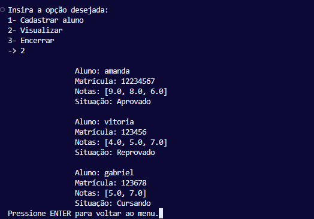
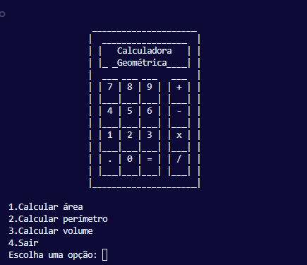
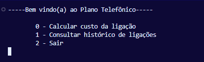
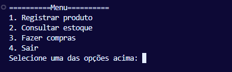
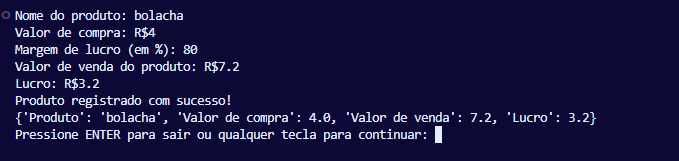

# 🐍 Atividades em Python

Este repositório reúne **atividades desenvolvidas em Python** com fins didáticos, cada uma abordando conceitos importantes de lógica de programação, estruturas de dados, matemática e simulação de sistemas simples.

## 📚 Atividades incluídas

### 1. `cadastro de aluno.py`
Sistema de cadastro de alunos que permite:
- Inserir nome, matrícula e notas
- Calcular média automaticamente
- Classificar como "Aprovado", "Reprovado" ou "Cursando"
- Visualizar todos os cadastros
  



### 2. `calculadora geométrica.py`
Calculadora interativa de geometria com interface no terminal:
- Cálculo de **área e perímetro** de quadrado, retângulo e círculo
- Cálculo da **área e volume** de cilindros
- Animações e visual estilizado com ASCII Art
  


### 3. `plano telefonico.py`
Simulador de plano telefônico:
- Calcula o custo de ligações entre diferentes DDDs
- Tabela de preços por origem/destino
- Armazena e exibe um histórico das últimas 5 ligações realizadas
  


### 4. `potencia e fatorial.py`
Programa matemático com decisões condicionais:
- Recebe dois números e avalia se são pares ou ímpares
- Executa operações diferentes com base nisso:
  - Dois pares: potência
  - Dois ímpares: soma dos fatoriais
  - Um par e um ímpar: fatorial dividido pela raiz quadrada
    


### 5. `valor de venda.py`
Sistema de gestão simples de produtos:
- Cadastro de produtos com cálculo automático de lucro e valor de venda
- Exibição do estoque
- Simulação de compras com carrinho e cálculo de total
  



## ✅ Requisitos
- Python 3 instalado

## 🚀 Como executar

1. Faça o download dos arquivos `.py`
2. Execute no terminal com:
```bash
python nome_do_arquivo.py
```
3. Siga o menu interativo apresentado

> 💡 Esses programas rodam inteiramente no terminal e são ótimos para quem está aprendendo lógica e estrutura de programação com Python!

## 🎓 Propósito
Essas atividades foram feitas com o objetivo de exercitar:
- Entrada e validação de dados
- Operações matemáticas
- Condições e loops
- Organização e reutilização de código com funções

---


